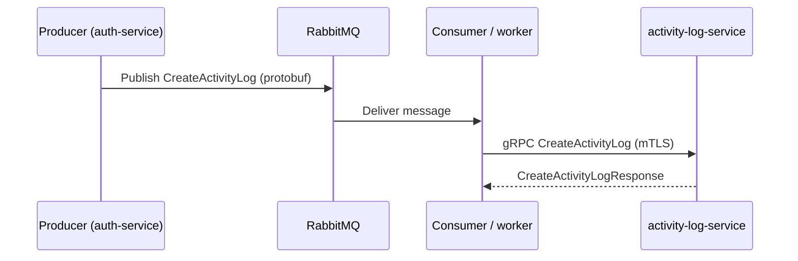

# PLAN.md — pkg-activitylogmq

Roadmap for activity-log messaging and delivery. Documentation-level plan; not a product commitment.

## Current state

| Layer | Implementation |
|-------|----------------|
| **Publish** | Watermill publisher → RabbitMQ / Pub/Sub / Kafka (`broker.go`) |
| **Consume** | Watermill subscriber → handler in `messaging/activity_log.go` |
| **Persist** | HTTP `POST /activity-logs` via `clients.ActivityLogClient` (`ACTIVITY_LOG_SERVICE_URL`) |
| **Payload** | JSON `CreateBody` (logName, subjectType, event, causerType, properties, …) |

**Flow today**

```
Producer service                Consumer (same or other service)          activity-log-service
─────────────────              ─────────────────────────────────         ────────────────────
EnqueueActivityLogCreate  →    RabbitMQ topic activity-log.create   →    HTTP POST /activity-logs
(messaging package)            handleActivityLogCreate                      (plain HTTP, no mTLS)
```

**Consumers in IlonaPay**

- **auth-service** — publisher (login events)
- **release-service** — publisher + in-process consumer (HTTP forward)
- **wallet-service**, **merchant-service**, **user-service**, **admin-service**, and others — enqueue via `messaging.EnqueueActivityLogCreate`

**Gaps**

- HTTP hop is unauthenticated beyond network placement (no mTLS, no service identity)
- Queue consumer and API client are coupled in one package; every consumer process runs a Watermill router even when only publishing
- `ActivityLogClient` is synchronous HTTP with a 5s timeout; no retries/backoff at the client layer
- No idempotency key on create (duplicate queue deliveries can duplicate rows)

## Target architecture (mTLS + gRPC)

**Goal:** Replace the HTTP bridge with a **gRPC ActivityLog API** on `activity-log-service`, with **mutual TLS** between internal services and the log service.

```
Producer service                Message broker (unchanged)              activity-log-service
─────────────────              ───────────────────────────              ────────────────────
EnqueueActivityLogCreate  →    activity-log.create                →    gRPC CreateActivityLog
                               (JSON or protobuf bytes)                 (mTLS server)
```

Longer term, publishers may call gRPC **directly** (sync or fire-and-forget) when latency matters and the broker is optional; the queue remains the default for decoupling and burst tolerance.



## Roadmap

### Phase 1 — API contract (no transport change)

- [ ] Add `api/proto/activitylog/v1/activity_log.proto` in **activity-log-service** (mirror `email-service` `notification.proto` layout)
- [ ] Define `ActivityLogService.Create` RPC with fields aligned to `clients.CreateBody` and `activity_log` table
- [ ] Generate Go stubs (`buf` or `protoc`); document `go_package` for importers
- [ ] Keep HTTP `POST /activity-logs` for backward compatibility during migration

### Phase 2 — gRPC server on activity-log-service

- [ ] Implement gRPC server alongside existing Gin HTTP server (separate port, e.g. `:50051`)
- [ ] Map RPC → `ActivityLogService.Create` repository path (same business rules as HTTP)
- [ ] Add health service (`grpc.health.v1`) for orchestration probes
- [ ] Compose: expose internal gRPC port on Docker network only (not published to host)
- [ ] Gateway: **no** public route; internal services only

### Phase 3 — mTLS

- [ ] Issue internal CA (dev: Compose-mounted certs under `docker/certs/` or secrets volume; prod: Cloud Run / GCP workload identity or cert-manager)
- [ ] Server: require client certificates (`grpc.Creds(credentials.NewTLS(serverTLS))`)
- [ ] Client: load client cert + CA pool (`credentials.NewClientTLSFromFile` or SPIFFE later)
- [ ] Env surface in this package:
  - `ACTIVITY_LOG_GRPC_ADDR` (e.g. `activity-log-service:50051`)
  - `ACTIVITY_LOG_GRPC_TLS_ENABLED` (default `true` in prod)
  - `ACTIVITY_LOG_GRPC_CA_CERT`, `ACTIVITY_LOG_GRPC_CLIENT_CERT`, `ACTIVITY_LOG_GRPC_CLIENT_KEY`
- [ ] Document rotation and local-dev bypass (`ACTIVITY_LOG_GRPC_TLS_ENABLED=false` for Compose only)

### Phase 4 — gRPC client in pkg-activitylogmq

- [ ] Add `clients/grpc_activity_log_client.go` implementing the same `Create(ctx, CreateBody)` shape
- [ ] Feature flag: `ACTIVITY_LOG_TRANSPORT=http|grpc` (default `http` until Phase 5)
- [ ] Connection pooling, dial timeouts, and gRPC retry policy for `UNAVAILABLE`
- [ ] Deprecate `ACTIVITY_LOG_SERVICE_URL` in favor of `ACTIVITY_LOG_GRPC_ADDR` once all consumers migrated

### Phase 5 — Consumer migration

- [ ] Update `messaging.handleActivityLogCreate` to call gRPC client instead of HTTP
- [ ] Roll out per service: auth-service, release-service, then remaining enqueue callers
- [ ] Integration tests: broker → consumer → gRPC → MySQL row
- [ ] Optional: publish protobuf on the wire (smaller messages, schema evolution via `optional` / `reserved`)

### Phase 6 — Hardening

- [ ] Idempotency: `message_id` or `idempotency_key` on RPC + unique index / dedup table
- [ ] Dead-letter queue for poison messages (Watermill DLQ or RabbitMQ DLX)
- [ ] Observability: gRPC interceptors for OTEL traces/metrics (align with `email-service` gRPC)
- [ ] Rate limiting / backpressure on activity-log-service gRPC server
- [ ] Remove HTTP create endpoint when all callers use gRPC (major version bump)

## Non-goals (for now)

- Replacing RabbitMQ with gRPC streaming for all audit events (queue stays for async fan-in)
- Exposing activity-log gRPC on user/admin gateways
- Changing `MESSAGE_BROKER` options (Pub/Sub, Kafka) — transport to the consumer remains broker-agnostic

## Dependencies

| Repo / package | Role |
|----------------|------|
| `admin/activity-log-service` | gRPC server, proto owner, persistence |
| `pkg-activitylogmq` (this repo) | Broker factory, consumer handler, gRPC client |
| `email-service` | Reference for proto layout and gRPC server patterns |
| Monorepo `docker-compose.*.yml` | Internal DNS, cert mounts, env wiring |
